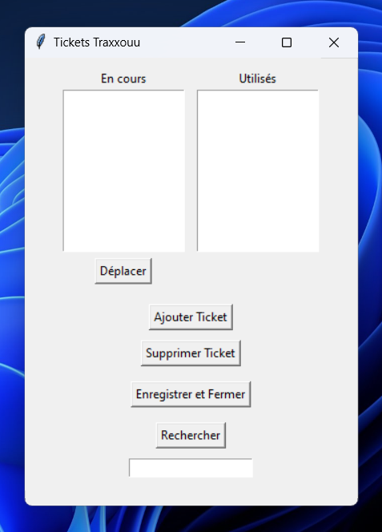
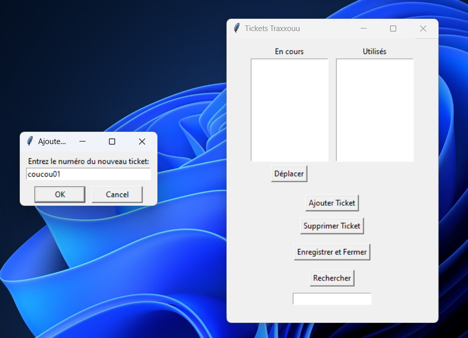
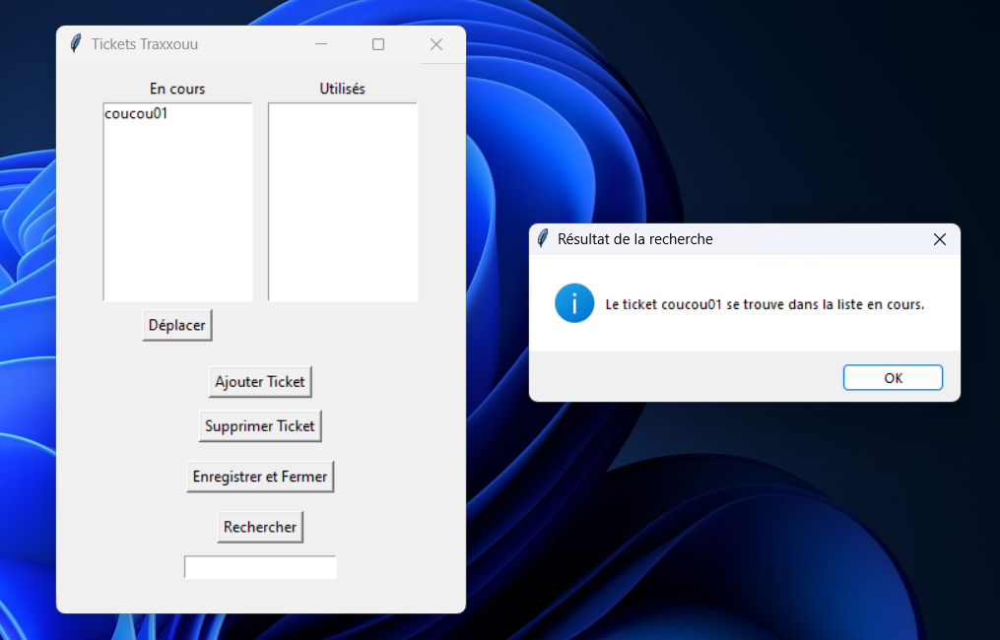

# Gestion des Tickets avec Tkinter

Bienvenue dans l'application de gestion de tickets ! Cette simple application, réalisée en utilisant Tkinter, offre une interface conviviale pour gérer vos tickets de manière efficace.

## Fonctionnalités

- **Ajout de Tickets**: Ajoutez facilement des tickets à la liste en cours en cliquant sur le bouton "Ajouter Ticket".

- **Déplacement de Tickets**: Déplacez les tickets de la liste en cours à la liste utilisée avec un simple clic sur le bouton "Déplacer".

- **Suppression de Tickets**: Supprimez les tickets indésirables de la liste en cours en utilisant le bouton "Supprimer Ticket".

- **Recherche de Tickets**: Trouvez rapidement l'emplacement d'un ticket spécifique en utilisant la fonction de recherche.

## Comment Utiliser l'Application

1. **Ajouter un Ticket**:
   - Cliquez sur le bouton "Ajouter Ticket".
   - Entrez le numéro du nouveau ticket dans la boîte de dialogue.

2. **Déplacer un Ticket**:
   - Sélectionnez un ticket dans la liste en cours.
   - Cliquez sur le bouton "Déplacer" pour le transférer vers la liste utilisée.

3. **Supprimer un Ticket**:
   - Sélectionnez un ticket dans la liste en cours.
   - Cliquez sur le bouton "Supprimer Ticket" pour le retirer de la liste.

4. **Rechercher un Ticket**:
   - Utilisez le bouton "Rechercher".
   - Entrez le numéro du ticket à rechercher.

## Captures d'écran

**Application**

**Ajouter**

**Rechercher**

##
  Profitez de la gestion simplifiée de vos tickets avec cette application conviviale ! N'hésitez pas à contribuer ou signaler des problèmes.

---
